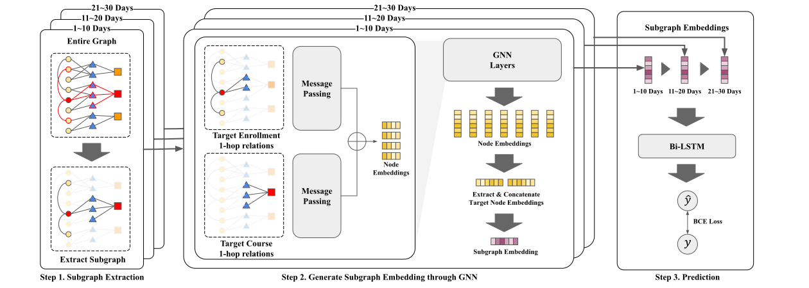

# SIG-Net

PyTorch implementation for SIG-Net: GNN based dropout prediction in MOOCs using Student Interaction Graph accepted by The 2024 ACM/SIGAPP Symposium on Applied Computing.


# Overview



As the COVID-19 pandemic has increased interest in remote learning, so has interest in massive open online courses (MOOCs). MOOCs have experienced rapid growth, offering the advantages of flexible education without time and space constraints. However, a serious challenge in MOOC learning remains high dropout rates; therefore, significant research efforts have been devoted to predicting student dropouts using deep learning as well as machine learning techniques. In this study, we show that graph neural networks (GNNs) can effectively recognize triadic patterns of interactions among students, objects, and courses, producing effective performance outcomes in MOOC dropout prediction. We propose the Student Interaction Graph Network (SIG-Net) model, which extracts subgraphs from a student interaction graph and predicts dropouts by learning student's interactions in the course that the subgraphs contain. In a student interaction graph, subgraphs provide important information about individual students' interactions in a particular course, which is very helpful for dropout prediction. Our model shows that GNNs can effectively learn from student interaction information in the course, and that student interaction information is very powerful in predicting student dropout. We evaluate the proposed model using two real-world datasets: KDDCUP 2015 and NAVER Edwith \& Boostcourse. This study is the first dropout prediction study using NAVER Edwith \& Boostcourse Our evaluation results show that SIG-Net is effective in learning from student interaction, outperforming the well-known machine learning and deep learning models.


# Dataset 
- KDDCUP 2015 dataset from : http://moocdata.cn/data/user-activity
- NAVER Edwith & Boostcourse dataset from : https://connect.or.kr/view/research_public.html
- Pre-processed dataset in `data` directory. 
- KDDCUP 2015 dataset directory is 'data/kddcup15'
- NAVER Edwith & Boostcourse dataset directory is 'data/naver'
<br />

# Docker Container
- Docker container use sig-net project directory as volume 
- File change will be apply directly to file in docker container
<br />

# Experiment 
1. `make up` : build docker image and start docker container
2. `python3 src/main.py` : start experiment in docker container
3. You can change the experiment config by adding a command. For example,`python3 src/main.py  --dataset naver`
4. you can check the result in `experiment_log/`
<br />

# Reference
This code is free and open source for only academic/research purposes (non-commercial). If you use this code as part of any published research, please acknowledge the following paper.
```
soon
```